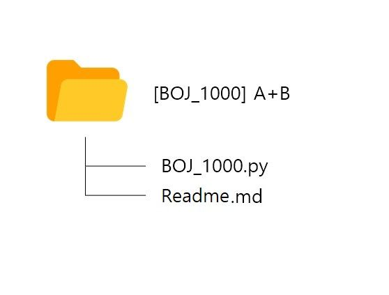

# Algo

## GitHub 사용 방법

### **✅ 참여 방법**

1. 저장소를 `fork` 한다.
2. 생성된 원격 저장소에 `이름` 으로 폴더를 생성한다.
3. 생성된 폴더에 자신의 소스코드를 업로드 한다. (폴더명에 콜론":" 안됩니다!)
4. 이때 `폴더 생성 규칙`을 지키도록한다!
5. 원본 저장소로 `Pull Request`를 한다. (매주 3문제 이상, 매주 일요일에 Merge예정)
6. 다른 사람들의 PR을 보고 자유롭게 코드리뷰를 한다.
7. ⚠***주의!! 기존 폴더를 지우면 안됩니다!!*** ⚠

### **✅ 소스코드 파일 이름 규칙**

- 자유롭게 작성
- 폴더명 또는 소스코드 파일명에 콜론 ":" 안됩니다 :D

### **✅ 폴더 생성 규칙**

- 자기 이름 폴더 안에 이미지처럼 `문제출처_문제번호` 문제이름으로 폴더 생성
- 그 안에 풀이 파일과 Readme.md 파일 생성
- Readme 파일에 문제정보(난이도, 푸는데 걸린시간, url 등)/ 접근방식/ 막혔던 부분 등 작성
  
- 문제정보 작성은 필수, 나머지는 자유

- 플랫폼 작성법 통일:
    - [BOJ] - 백준
    - [PGS] - 프로그래머스
    - [LTC] - 리트코드
    - [CFS] - 코드포스
    - [SWEA] - 삼성SW Expert Academy
    - [ETC] - 그외

### **✅ PR 규칙**

- PR 제목: 이름 / 주차
- `황태희 / 2월 1주차

### **✅ (option)코드리뷰 규칙**

- PR에서 코드리뷰를 한다.
- 전체 코드 흐름을 파악한 뒤, 이 분이 어떻게 풀었을까 이해를 한 후
- 의견제시
    - 잘했다고 생각하는 부분
    - 이렇게 하면 더 좋을 것 같다고 생각하는 부분
    - 왜 이렇게 풀었는지 궁금한 부분
    - 또 다른 풀이 방식 제시
- 코드의 일부분에다 코드리뷰를 해도 되고 전체 코드 밑 or PR 하나 밑에다 코멘트 작성으로 리뷰를 해도 됩니다.